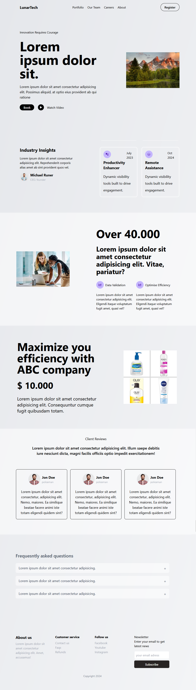

# React - generic framer motion app

# 🔗 [Live Preview]()

---

## About Project 👋

This app is just a practice React project, at using tailwind, and framer motion, it is a generic website.

Created with Vite

---

## Features & How it works

- All the components are mainly presentational components that dont have any special functionality. When the user scrolls into view certain components, an animation will trigger. Faq.jsx only has one state that toggles on/off between opening the question/answer and closing 

---

## Technologies & Dependencies used 📦

- **React:** usestate, react icons...

- **Styling:** tailwind css

- **Animation:** framer motion

dependencies:

- "framer-motion": "^11.5.4",
- "react": "^18.3.1",
- "react-dom": "^18.3.1",
- "react-icons": "^5.3.0"

devDependencies:

- "@eslint/js": "^9.9.0",
- "@types/react": "^18.3.3",
- "@types/react-dom": "^18.3.0",
- "@vitejs/plugin-react": "^4.3.1",
- "autoprefixer": "^10.4.20",
- "eslint": "^9.9.0",
- "eslint-plugin-react": "^7.35.0",
- "eslint-plugin-react-hooks": "^5.1.0-rc.0",
- "eslint-plugin-react-refresh": "^0.4.9",
- "globals": "^15.9.0",
- "postcss": "^8.4.47",
- "tailwindcss": "^3.4.12",
- "vite": "^5.4.1"

---

## Prerequisites 📚

Ensure you have the following installed on your system:

    Node.js v18.00.0
    npm or yarn

---

## Clone & Run locally 🏃‍♂️

1. **Clone the Repository:**

   - On the GitHub repo page, click the green "Code" button.

   - Copy the HTTPS URL.

2. **Open the Terminal:**

   - Open the terminal by typing "cmd" in your desktop's start menu, **OR**

   - Right-click on the desktop and select "Git Bash Here" (if you have Git Bash installed), **OR**

   - Open Visual Studio Code's terminal by clicking "Terminal" -> "New Terminal" inside the editor.

3. **Navigate to Your Project Location:**

   - In the terminal, navigate to your desired location (e.g., desktop) using the command: `cd desktop`. Adjust the path if your project is located elsewhere.

   - Ensure that your terminal's address is inside the project folder.

4. **Clone the Repository:**

   - Run the command: `git clone /link/`. Replace `/link/` with the HTTPS URL from step 1.

5. **Enter the Project Directory:**

   - Navigate into the cloned repository by typing: `cd /folder-name/`. Replace `/folder-name/` with the name of the cloned folder.

6. **Install Dependencies:**

   - Run the command: `npm install` to install all the necessary dependencies.

7. **Start the Project:**

   -  Run the command: `npm start` or `yarn start` to start the project, if the project is created using create-react-app. It will open in your default browser at [localhost:3000/](http://localhost:3000/)
     **OR**
   - Run the command: `npm run dev` or `yarn dev` to start the project, if the project is created using Vite. You will need to manually open the browser address at [localhost:5173/](http://localhost:5173/)

---

## Project Structure 📂

    project-name/
    ├── public
    ├── src
    │ ├── assets
    │ ├── components
    │ │ ├── (all the components)
    │ ├── App.jsx
    │ ├── index.css
    │ ├── main.jsx
    ├── .env 
    ├── package.json 
    ├── index.html 
    └── README.md 
    (rest of the configs)

---

## Contributing 💻

Contributions are closed at the moment!

---